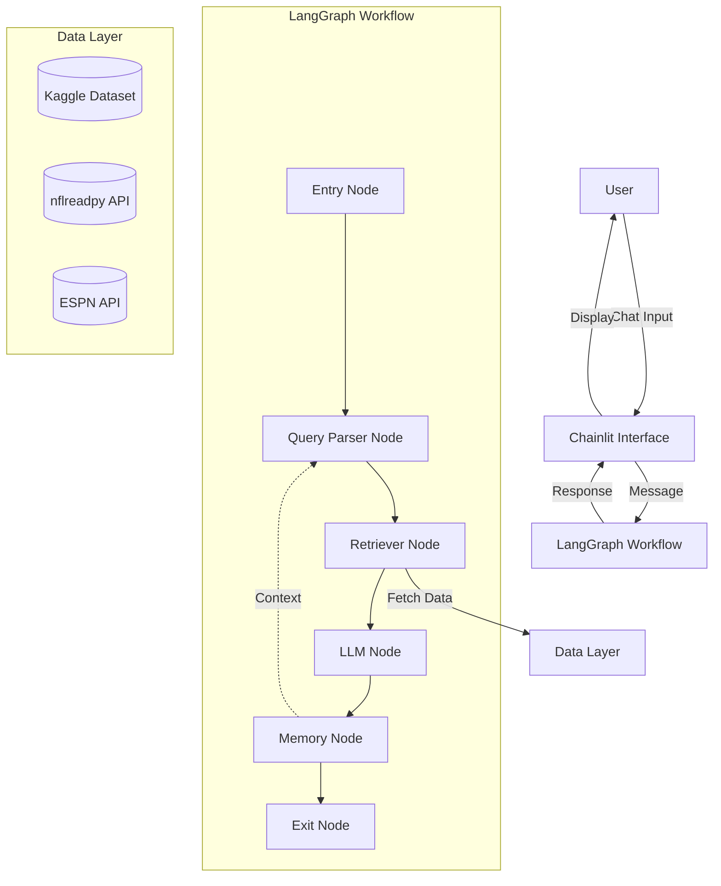

# Design Document

## Overview

The NFL Player Performance Chatbot is built using Chainlit for the web interface and LangGraph for orchestrating a stateful, multi-node workflow. The system processes natural language queries about NFL player statistics through a pipeline that parses questions, retrieves data, generates insights, and maintains conversation context.

### Technology Stack

- **Frontend/Interface**: Chainlit (Python-based chat UI framework)
- **Workflow Orchestration**: LangGraph (state machine for LLM applications)
- **LLM**: OpenAI GPT-4 or similar (for query parsing and insight generation)
- **Data Processing**: Pandas for data manipulation
- **Data Sources**: 
  - Kaggle NFL Player Stats dataset (1999-2023)
  - nflreadpy for current season data
  - ESPN API (unofficial) as supplementary source
- **Language**: Python 3.10+

## Architecture

### High-Level Architecture



### LangGraph State Machine

The workflow uses a shared state object that flows through each node:

```python
class ChatbotState(TypedDict):
    messages: List[BaseMessage]
    user_query: str
    parsed_query: Dict[str, Any]
    retrieved_data: pd.DataFrame
    generated_response: str
    conversation_history: List[Dict[str, str]]
    error: Optional[str]
```

### Workflow Flow

1. **Entry Node**: Receives user input from Chainlit, initializes state
2. **Query Parser Node**: Converts natural language to structured query
3. **Retriever Node**: Fetches relevant data from data sources
4. **LLM Node**: Generates natural language insights from data
5. **Memory Node**: Updates conversation context
6. **Exit Node**: Returns response to Chainlit

## Components and Interfaces

### 1. Chainlit Interface Layer

**Purpose**: Provides web-based chat UI and handles user interactions

**Key Components**:
- `app.py`: Main Chainlit application entry point
- Message handlers for user input
- Streaming response handlers
- Session management

**Interface**:
```python
@cl.on_chat_start
async def start():
    """Initialize chat session and LangGraph workflow"""
    
@cl.on_message
async def main(message: cl.Message):
    """Process incoming user messages through LangGraph"""
```

### 2. Query Parser Node

**Purpose**: Converts natural language questions into structured queries

**Responsibilities**:
- Extract player names, teams, statistics, time periods
- Resolve ambiguous references using conversation context
- Generate structured filter criteria for data retrieval
- Handle multi-player comparisons

**Implementation Approach**:
- Use LLM with structured output (function calling or JSON mode)
- Provide schema for query structure
- Include conversation history for context resolution

**Output Schema**:
```python
{
    "players": ["Patrick Mahomes", "Josh Allen"],
    "statistics": ["completion_rate", "yards"],
    "time_period": {"season": 2023, "weeks": [1, 17]},
    "filters": {"situation": "under_pressure"},
    "comparison": True
}
```

### 3. Retriever Node

**Purpose**: Fetches relevant player statistics from data sources

**Responsibilities**:
- Route queries to appropriate data source based on time period
- Apply filters from parsed query
- Handle data source failures with fallbacks
- Normalize data formats across sources

**Data Source Priority**:
1. nflreadpy (for current season and recent data)
2. Kaggle dataset (for historical data 1999-2023)
3. ESPN API (as fallback/supplementary)

**Interface**:
```python
def retrieve_data(parsed_query: Dict[str, Any]) -> pd.DataFrame:
    """Fetch and filter player statistics"""
```

### 4. LLM Node

**Purpose**: Generates natural language insights from retrieved data

**Responsibilities**:
- Analyze statistical data
- Generate contextual insights (trends, comparisons, rankings)
- Provide explanations for significant findings
- Format response for readability

**Prompt Strategy**:
- Include retrieved data in structured format
- Provide context about what makes statistics significant
- Request specific formatting (bullet points, percentages, etc.)
- Include conversation history for coherent multi-turn responses

### 5. Memory Node

**Purpose**: Maintains conversation context across turns

**Responsibilities**:
- Store conversation history (last 10 turns)
- Track mentioned players and statistics
- Provide context to Query Parser for reference resolution
- Clear context on session reset

**Storage**:
- In-memory storage using Chainlit session state
- Structure: List of dicts with user queries and bot responses

**Interface**:
```python
def update_memory(state: ChatbotState) -> ChatbotState:
    """Update conversation history with latest interaction"""
```

### 6. Data Layer

**Purpose**: Manages access to NFL statistics datasets

**Components**:

**a) Kaggle Dataset Handler**
- Load CSV files into Pandas DataFrames
- Index by player name and season for fast lookups
- Cache loaded data in memory

**b) nflreadpy Client**
- Use nflreadpy Python package
- Fetch current season data
- Update cache daily during NFL season

**c) ESPN API Client**
- HTTP client for ESPN endpoints
- Parse JSON responses
- Handle rate limiting and errors

**Interface**:
```python
class DataSource(ABC):
    @abstractmethod
    def get_player_stats(self, player_name: str, season: int, 
                        stats: List[str]) -> pd.DataFrame:
        pass

class KaggleDataSource(DataSource):
    """Implementation for Kaggle dataset"""

class NFLReadPyDataSource(DataSource):
    """Implementation for nflreadpy"""

class ESPNDataSource(DataSource):
    """Implementation for ESPN API"""
```

## Data Models

### Player Statistics Schema

```python
@dataclass
class PlayerStats:
    player_name: str
    team: str
    position: str
    season: int
    week: Optional[int]
    
    # Passing stats
    completions: Optional[int]
    attempts: Optional[int]
    passing_yards: Optional[int]
    touchdowns: Optional[int]
    interceptions: Optional[int]
    
    # Receiving stats
    targets: Optional[int]
    receptions: Optional[int]
    receiving_yards: Optional[int]
    
    # Advanced metrics
    epa: Optional[float]  # Expected Points Added
    completion_rate: Optional[float]
    yards_per_attempt: Optional[float]
```

### Conversation Context Schema

```python
@dataclass
class ConversationTurn:
    user_query: str
    bot_response: str
    mentioned_players: List[str]
    mentioned_stats: List[str]
    timestamp: datetime
```

## Error Handling

### Error Categories and Strategies

1. **Data Source Unavailable**
   - Attempt fallback to alternative sources
   - Return cached data if available
   - Inform user of data limitations

2. **Query Parsing Failure**
   - Request clarification from user
   - Suggest example queries
   - Log ambiguous queries for improvement

3. **No Data Found**
   - Verify player name spelling
   - Suggest alternative time periods
   - Provide helpful error message

4. **LLM API Errors**
   - Retry with exponential backoff (max 3 attempts)
   - Fall back to template-based responses
   - Log errors for monitoring

5. **Invalid User Input**
   - Validate input format
   - Provide clear error messages
   - Guide user toward valid queries

### Error Handling in LangGraph

```python
def handle_node_error(state: ChatbotState, error: Exception) -> ChatbotState:
    """Centralized error handling for workflow nodes"""
    state["error"] = str(error)
    state["generated_response"] = generate_error_message(error)
    return state
```

## Testing Strategy

### Unit Tests

**Query Parser Node**:
- Test extraction of player names, stats, time periods
- Test handling of ambiguous queries
- Test context resolution with conversation history

**Retriever Node**:
- Test data fetching from each source
- Test filter application
- Test fallback logic
- Mock external API calls

**LLM Node**:
- Test insight generation with sample data
- Test response formatting
- Mock LLM API calls

**Memory Node**:
- Test conversation history storage
- Test context retrieval
- Test history size limits

### Integration Tests

- Test complete workflow from user query to response
- Test multi-turn conversations with context
- Test error handling across nodes
- Test data source failover

### End-to-End Tests

- Test Chainlit interface with LangGraph workflow
- Test streaming responses
- Test session management
- Test concurrent user sessions

### Test Data

- Create fixture datasets with known player statistics
- Mock API responses for consistent testing
- Use historical data for regression testing

## Performance Considerations

### Caching Strategy

1. **Data Caching**
   - Cache Kaggle dataset in memory on startup
   - Cache nflreadpy data with daily TTL
   - Cache frequently queried player stats

2. **Query Caching**
   - Cache parsed queries for identical user inputs
   - Cache LLM responses for common questions

### Optimization

- Use Pandas vectorized operations for data filtering
- Implement connection pooling for API clients
- Stream LLM responses to reduce perceived latency
- Lazy load data sources on first use

### Scalability

- Stateless workflow design allows horizontal scaling
- Use Redis for shared session state if needed
- Implement rate limiting for API calls
- Monitor and optimize LLM token usage

## Deployment

### Local Development

```bash
# Install dependencies
pip install chainlit langgraph pandas nflreadpy openai

# Set environment variables
export OPENAI_API_KEY=your_key

# Run Chainlit app
chainlit run app.py
```

### Production Considerations

- Use environment variables for API keys
- Implement logging and monitoring
- Set up error tracking (e.g., Sentry)
- Configure CORS for web deployment
- Use HTTPS for secure communication

## Future Enhancements

1. **Visualization Support**: Generate charts and graphs for statistics
2. **Advanced Analytics**: Add predictive models for player performance
3. **Multi-Sport Support**: Extend to other sports beyond NFL
4. **Voice Interface**: Add speech-to-text for voice queries
5. **Export Functionality**: Allow users to export data and insights
6. **Custom Alerts**: Notify users of significant player performance changes
