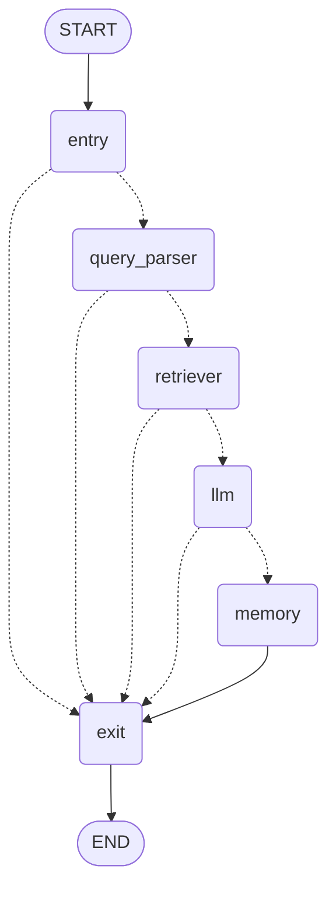

# NFL Player Performance Chatbot - LangGraph Workflow Diagram

## Visual Diagram

The workflow diagram has been generated and saved as `workflow_diagram.png`.

## Workflow Overview

The chatbot uses a LangGraph state machine with 6 nodes and conditional routing for error handling:

```
START → entry → query_parser → retriever → llm → memory → exit → END
```

## Node Descriptions

### 1. **Entry Node**
- **Purpose**: Initialize workflow state and validate input
- **Actions**:
  - Initialize conversation history
  - Validate user query is not empty
  - Add user message to state
- **Exit Routes**:
  - ✓ Success → `query_parser`
  - ✗ Empty query → `exit`

### 2. **Query Parser Node**
- **Purpose**: Convert natural language to structured query format
- **Actions**:
  - Parse player names, statistics, time periods
  - Identify query intent (comparison, trend, single player)
  - Extract structured parameters
- **Exit Routes**:
  - ✓ Success → `retriever`
  - ✗ Parsing error → `exit`
  - ✗ Clarification needed → `exit`

### 3. **Retriever Node**
- **Purpose**: Fetch player statistics from data sources
- **Actions**:
  - Query NFL data sources (nflreadpy, ESPN, Kaggle)
  - Apply fallback logic if primary source fails
  - Filter and prepare data for analysis
- **Exit Routes**:
  - ✓ Data found → `llm`
  - ✗ No data found → `exit`
  - ✗ Retrieval error → `exit`

### 4. **LLM Node**
- **Purpose**: Generate natural language insights from data
- **Actions**:
  - Analyze retrieved statistics
  - Generate contextual response
  - Format insights for user
- **Exit Routes**:
  - ✓ Response generated → `memory`
  - ✗ LLM error → `memory` (continues to save context)

### 5. **Memory Node**
- **Purpose**: Update conversation history
- **Actions**:
  - Store user query and bot response
  - Maintain conversation context
  - Enable follow-up questions
- **Exit Routes**:
  - Always → `exit`

### 6. **Exit Node**
- **Purpose**: Finalize workflow and prepare response
- **Actions**:
  - Ensure response exists
  - Log final state
  - Clean up resources
- **Exit Routes**:
  - Always → `END`

## Error Handling

The workflow implements comprehensive error handling at each node:

- **Recoverable Errors**: Route to exit with helpful message
- **Non-Critical Errors**: Continue workflow (e.g., memory failures)
- **Critical Errors**: Stop processing and return error response

### Error Flow Examples

1. **Empty Query**: `entry` → `exit`
2. **Parsing Failed**: `entry` → `query_parser` → `exit`
3. **No Data Found**: `entry` → `query_parser` → `retriever` → `exit`
4. **LLM Error**: `entry` → `query_parser` → `retriever` → `llm` → `memory` → `exit`

## State Schema

The workflow maintains a `ChatbotState` with:

```python
{
    "messages": List[BaseMessage],           # LangChain messages
    "user_query": str,                       # Original user input
    "parsed_query": Dict,                    # Structured query
    "retrieved_data": DataFrame,             # Player statistics
    "generated_response": str,               # Final response
    "conversation_history": List[Dict],      # Chat history
    "error": Optional[str],                  # Error type if any
    "session_id": Optional[str]              # Session identifier
}
```

## Conditional Routing Logic

### After Entry
```python
if error == "empty_query":
    → exit
else:
    → query_parser
```

### After Query Parser
```python
if error in ["query_parser", "clarification_needed"]:
    → exit
elif not parsed_query:
    → exit
else:
    → retriever
```

### After Retriever
```python
if error == "retriever":
    → exit
elif no data retrieved:
    → exit
else:
    → llm
```

### After LLM
```python
if error == "llm":
    → memory  # Continue to save context
elif no response:
    → exit
else:
    → memory
```

## Performance Requirements

- **Response Time**: < 10 seconds (Requirement 1.3)
- **Error Recovery**: Continue operating after errors (Requirement 7.5)
- **Clear Messages**: User-friendly error messages (Requirement 7.2)

## Mermaid Diagram

The Mermaid diagram source is available in `workflow_diagram.mmd` and can be visualized at [mermaid.live](https://mermaid.live/).



## Usage

To regenerate the diagram:

```bash
# Generate PNG image
python generate_diagram.py

# Generate Mermaid text
python generate_mermaid_text.py
```

## Files Generated

- `workflow_diagram.png` - Visual PNG diagram
- `workflow_diagram.mmd` - Mermaid source code
- `generate_diagram.py` - Script to generate PNG
- `generate_mermaid_text.py` - Script to generate Mermaid text
